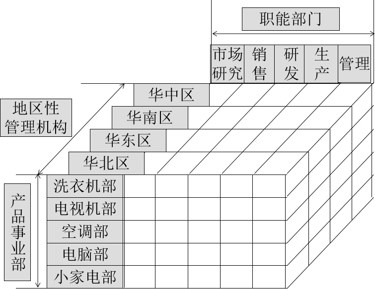
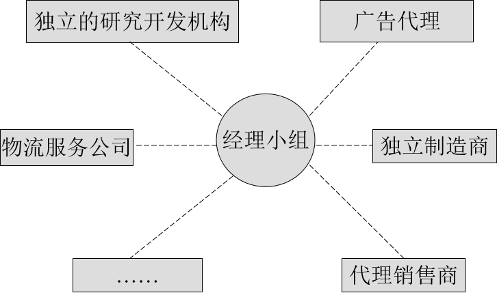

# 管理学
***
## 管理学原理
### 1. 改变航道原理
是指计划工作为将来承诺得越多，主管人员定期检查现状和预期前景，以及为保证所要达到的目标而重新制订计划就越重要。 计划的总目标不变，但实现目标的进程（即航道）可以因情况的变化随时改变。
**（遇到特殊情况的应变）**
### 2. 灵活性原理
指行政计划的灵活性越大，因未来意外事件引起损失的可能性就越小，两者是 反比例关系 。 灵活性原理 是行政 计划工作 中最主要的原理，它主要针对计划的制定过程，使计划本身具有适应性，要求计划的制定“量力而行，留有余地”。
**（计划的灵活性）**
### 3. 许诺原理
是指任何一项计划都是对完成某项工作所做出的许诺。 许诺越大，所需的时间越长，实现目标的可能性就越小；反之亦然。 按照许诺原理的要求，计划工作许诺的任务不能太多。 因为许诺太多，计划期就越长，这期间的不确定性就越大，真正实现计划目标的把握就越小。
### 4.限定因素原理
限定因素原理是指在计划工作中，越是能够了解和找到对达到所要求目标起限制性和决定性作用的因素，就越是能准确地、客观地选择可行的方案。 限定因素原理是决策的精髓，决策的关键就是解决抉择方案所提出的问题，即尽可能地找出和解决限定性的或策略性的因素。
***
## 计划的方法

## 正式沟通的五种形式
### 1.链式
链式沟通属于控制型结构，它严格按照直线职权关系和指挥链系统的逐级传递信息，信息容易失真，参与成员的联系面窄，平均满意度低。
### 2.环式
环式沟通也称圆周式沟通，类似链式沟通，但信息链首尾相连形成封闭的信息沟通的环。这种组织内部的信息沟通是指不同成员之间依次联络沟通。环式沟通的沟通成员相互基于平等的沟通地位，与周边的成员互动与沟通，且沟通过程中没有任何一方主控讯息的传送与回馈。
### 3.Y 式
Y式沟通是指链式沟通的途中变换为环式沟通，是链式沟通与环式沟通的结合。其速度、满意度、失真度等也介于链式沟通与环式沟通之间，适用于主管人员的工作任务十分繁重，需要有人选择信息，提供决策依据，节省时间，而又要对组织实行有效的控制。
### 4.轮式
轮式沟通是指最初发信者直接将信息同步辐射式发送到最终受信者。轮式沟通过程中有一明显的主导者，凡讯息的传送与回馈均需经过此主导者，且沟通成员也通过此主导者才能相互沟通。
### 5.全通道式
全通道式沟通是指所有沟通参与者之间穷尽所有沟通渠道的全方位沟通。这是一种非等级式沟通，满意度高、失真度低，但规模受限、速度低
***
## 目标管理
德鲁克首先提出目标管理
组织的最高领导层根据组织面临的形势和社会需要，制定出一定时期内组织经营活动所要达到的总目标，然后层层落实，要求下属各部门主管人员以至每个员工根据上级制定的目标和保证措施，形成一个目标体系，并把目标完成的情况作为各部门或个人考核的依据。
### 目标管理的优点
比较科学和有效的管理方法（强调结果）；

有助于改进组织结构和职责分工；

进一步调动职工的主动积极性，提高士气；

表现出良好的整体性。

### 目标管理的缺点
标难以制定；

一般是短期目标，易造成与长期目标脱节；

目标管理的哲学假设不一定都存在；（对人的动机作了过分乐观的假设“自我实现人”）

目标的商定很费时间，实施中不灵活；

易于急功近利；

理论普及和宣传欠缺

## 组织结构的几种类型
### 1. [直线制结构](https://baike.baidu.com/item/%E7%9B%B4%E7%BA%BF%E5%9E%8B%E7%BB%84%E7%BB%87%E7%BB%93%E6%9E%84/1649241)
织中每一位主管人员对其直接下属拥有直接职权，而下属部门则只接受一个上级的指令，组织中的每一个人只对他的直接上级负责或报告工作。
### 2. [职能制结构](https://baike.baidu.com/item/%E8%81%8C%E8%83%BD%E5%9E%8B%E7%BB%84%E7%BB%87%E7%BB%93%E6%9E%**84**)
职能型组织结构是以工作方法和技能作为部门划分的依据。我们知道现代企业的很多业务活动都需要具有专业知识和能力的人来完成，因此将这样的人员归类组合到一个团队的内部，可以更有效地开发和使用技能，提高工作的效率。
### 3. [直线职能制结构](https://baike.baidu.com/item/%E7%9B%B4%E7%BA%BF%E8%81%8C%E8%83%BD%E5%9E%8B%E7%BB%84%E7%BB%87%E7%BB%93%E6%9E%84/2376361)
以直线为基础，在各级行政主管之下设置相应的职能部门，比如销售、供应、财务等部门，从事专业管理，作为该级行政主管的参谋，实行主管统一指挥与职能部门参谋指导相结合的结构模式。在直线职能型结构下，下级机构既受上级部门的管理，又受同级职能管理部门的业务指导和监督。
### 4.[矩阵制结构](https://baike.baidu.com/item/%E7%9F%A9%E9%98%B5%E7%BB%84%E7%BB%87%E7%BB%93%E6%9E%84/8527746)
简单来说在一个大的企业组织内，为了实现某个特别的工作任务，组织另外成立项目小组，这个项目小组与原组织配合，在型态上有并行交叉，这种情况就是矩阵式组织形式。实际上，这种组织结构是按项目为对象来设置的，项目的管理人员从职能部门抽调，项目完成管理人员又回归职能部门。
### 5.[事业部制](https://baike.baidu.com/item/%E4%BA%8B%E4%B8%9A%E9%83%A8%E5%88%B6/5300793)
事业部制是分级管理、分级核算、自负盈亏的一种形式，即一个组织按地区或按产品类别分成若干个事业部。从产品的设计、原料采购，一直到产品销售，均由事业部及所属工厂负责，实行单独核算、独立经营，公司总部只保留人事决策，预算控制和监督大权，并通过利润等指标对事业部进行控制
### 多维立体型

### 网络型

### 流程型

### 模拟分权型
大型连续型生产企业模拟事业部型，各生产单位独立经营、单独核算 ，生产单位间依据企业内部价格进行经济核算
### 控股型
企业间资本参与关系为基础（绝对控股，相对控股，一般参股），母公司是大股东，母子之间是产权管理关系
***
## 管理中期代表人物
1. 巴纳德
把个人目标与组织目标结合起来
2. 梅奥
 [跳转到社会人假设](#1社会人假设霍桑实验)
***
## 管理职能
### 1. 计划
实现组织既定目标，对未来的行动进行规划和安排的活动。
### 2. 组织
为达到组织目标将从事的各项工作或活动进行分类组合，划分部门，并根据系统原理建立起上下左右的协调关系
### 3. 领导
指挥或带领、引导或鼓励追随者为实现目标而努力的过程。
### 4. 控制
组织在动态环境中为保证既定目标的实现而采取的检查和纠偏的活动或过程。
***
## 决策的基本步骤
研究现状，提出问题。确定决策目标。制定各种可行方案。对方案进行评价和选择。决策的执行与反馈。
***
## 四种领导行为
1. 指导型领导
高工作 低关系
2. 支持型领导
高工作 高关系
3. 参与型领导
低工作 高关系
4. 授权型领导
低工作 低关系
***
## 四种决策类型
### 1.程序化决策
程序化决策是指可以制定出固定程序而进行的决策
### 2.确定型决策
确定型决策指决策者对未来可能发生的情况有十分确定的比较，可以直接根据完全确定的情况选择最满意的行动方案
### 3.[风险型决策](https://zh.wikipedia.org/wiki/%E9%A3%8E%E9%99%A9%E5%86%B3%E7%AD%96)
风险决策 也就是通常所说的 不确定条件下的决策. 当人们虽然知道有哪些可能的环境状态,但却并不知道具体每种环境状态的概率时，同时把环境的进入概率看作风险, 即存在 未知条件下的决策,
### 4.不确定型决策
非程序化决策是指不可以制定出一套固定的程序，通常只能“现裁先做”的决策，又称为一次性决策。
## 四种人性假设
### 1.[社会人假设](https://wiki.mbalib.com/wiki/%E2%80%9C%E7%A4%BE%E4%BC%9A%E4%BA%BA%E2%80%9D%E5%81%87%E8%AE%BE)
（霍桑实验）:
**人由社会需求引起工作动机的，社会性需求的满足比经济上的报酬更能激励人们

管理上，注意工作目标的完成外，更应注意人们的需求；重视职工之间的关系，培养职工的归属感和认同感；提倡集体奖励制度**
### 2.[经济人假设](https://wiki.mbalib.com/wiki/%E2%80%9C%E7%BB%8F%E6%B5%8E%E4%BA%BA%E2%80%9D%E5%81%87%E8%AE%BE)
(麦格雷戈的X理论)
起源于享乐主义，经十九世纪合理主义的影响而形成

人的行为是为了最大限度的满足自己的利益，工作动机是为了获取经济报酬。

管理方式：以经济报酬来使人们服从和作出功效，以权力与控制体系来保护组织及引导职工

管理重点在于提高效率
### 3.[自我实现人假设](https://wiki.mbalib.com/wiki/%E8%87%AA%E6%88%91%E5%AE%9E%E7%8E%B0%E4%BA%BA%E5%81%87%E8%AE%BE)
(美国心理学家 马斯洛 麦格雷戈的Y理论)

人都需要发挥自己的潜力，表现自己的才能，只有人的潜力充分发挥出来，人的才能表现出来，人才会感到最大的满足

只要环境条件有利，工作同游戏或休息一样自然

人们在执行任务中能够自我指导和自我控制

管理方式：安排好组织工作条件和作业的方法，使人们的智慧与潜能充分发挥出来
### 4.[复杂人假设](https://wiki.mbalib.com/wiki/%E5%A4%8D%E6%9D%82%E4%BA%BA%E5%81%87%E8%AE%BE)
(沙因提出)
人的需要是多种多样的，而且随着人的发展和生活条件变化而发生改变；每个人的需要各不相同，需要的层次也因人而异

人在同一时间内有多种需要和动机，它们相互作用并结合成统一的整体，形成错综复杂的动机模式

人在组织中的工作和生活条件是不断变化的，会产生新的需要和动机

没有适合于任何组织、任何时间、任何个人的统一的管理方式
***
## 两种决策
### 战略决策
战略决策是指企业制定长期发展目标和规划，确定企业未来的方向和重点任务，包括资源配置、市场定位、组织结构等方面。战略决策是企业高层管理者根据内外部环境和自身情况所做出的决策，具有长远性、全局性和系统性。**高层管理者做**
### 战术决策
战术决策是指企业为实现战略目标而采取的具体措施和行动计划，是战略目标的具体实施方案。战术决策通常由中层管理者制定，具有一定的灵活性和可操作性。 **中层管理者**
## 管理学杂
1. 对于各层管理者同样重要的技能是 人际技能
2. 菲德勒的权变理论中的领导权变因素包括职位权力、任务结构 和 上下级关系。
3. 古典管理理论的三大代表人物是泰罗、法约尔和韦伯
    1. 泰罗**科学管理理论**
泰罗科学管理的中心问题是提高劳动生产率
实现最高工作效率的手段，是用科学的管理代替传统的管理
    2. 法约尔**一般管理理论**
其中，他对企业内部的管理活动进行整合，提出了管理的五项职能。这些被认为是最早出现的企业战略思想，其核心是拟定一个能涵盖企业各方面收入、支出状况的预算，并将经营实绩与之比较，以求控制成本和调整企业的生产行为。[一般管理理论](https://zh.wikipedia.org/wiki/%E4%BA%A8%E5%88%A9%C2%B7%E6%B3%95%E7%BA%A6%E5%B0%94)
4. 决策者遵循有限理性和满意准则
5. 管理是一门艺术，这是强调管理的复杂性
6. 企业中存在着非正式组织的观点来源于霍桑实验结论
7. 可以使管理幅度增加的因素是组织信息管理系统先进
8. 韦伯认为理想的行政组织的权力基础应是合理-合法的权力
9.  管理理论产生于二十世纪初
10. 领导者可以通过职位权力和个人权力来影响他人的活动。
11. 目标管理强调成果管理和自我控制
12. 对经营与管理进行明确界定的管理学家是亨利•法约尔
13. 产生多头领导现象的根本原因是组织设计中违反了统一命令或统一指挥原则。
14. 领导者的影响力来自于职位权力和个人权力。
15. 良好的沟通意味着信息的传达与接收的一致性，并不一定双方意见一致。
16. 领导行为的有效性受到领导情境的影响。哪种方式更合适，取决于具体情境。因而，不存在最好的领导方式，只有最合适的领导方式。
17. 赫伯特·西蒙 :决策策在一定的约束条件下进行，最优决策要求经济、时间等资源的无约束，以及主观评价标准的一致性，而这些在实践中是不可能的。人们受到有限理理性的约束，实践作出的决策往往是满意决策。
18. 领导型格伦理论认为，领导工作的有效性与领导的风格及具体的工作情境有关。
19. 在确定经营单位的活动方向时，应考虑其相对竞争地位和业务增长情况
20. 四种企业类型 
 1.金牛（相对竞争地位高，业务增长率低）。
 2.明星（相对竞争地位高，业务增长率高）
 3.瘦狗（相对竞争地位低，业务增长率低） 
 4.幼童（相对竞争地位低，业务增长率高）
21. 